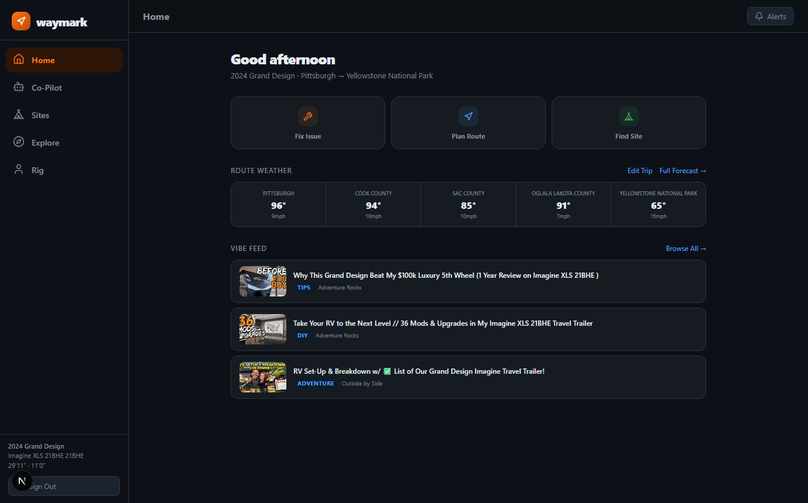

# Waymark

**Live: [waymark-one.vercel.app](https://waymark-one.vercel.app)**

An AI-powered RV co-pilot built with Next.js. Chat runs two ways: Gemini in the cloud, and Llama 3.2 fully offline in the browser via WebLLM, so it still answers at a campsite with no signal.

## Features
- **Waymark AI**: one unified assistant for repairs, routes, and campsites, tuned to your specific rig
- **Offline mode**: Llama 3.2 runs in-browser (WebLLM + WebGPU) and answers with zero network; a manual Auto / Cloud / Offline toggle shows which engine is active
- **Installable PWA**: install from the browser (desktop or phone) and the whole app opens with no connection: service-worker cached shell, locally mirrored rig profile, last saved route weather, and the offline assistant; a dashboard prompt suggests downloading the offline AI before a trip
- **Route Weather**: live conditions at real waypoints along your trip, plus a multi-day driving forecast (Open-Meteo + Nominatim, no API keys)
- **Campsite Search**: real campgrounds from Recreation.gov, searchable by state or by radius around your destination
- **Vibe Feed**: RV videos matched to your exact rig, fetched without YouTube API quota limits
- **Rig Profile**: stores your dimensions, floor plan, and memberships (Supabase with row level security)

## How offline mode works
On first use the app downloads a quantized Llama 3.2 1B model (~700MB) into browser storage via WebLLM. After that, the model loads from cache and inference runs entirely on-device through WebGPU. If the cloud call fails or you flip the toggle to Offline, questions are answered locally: tested by disabling the network entirely and asking an emergency question.

## Tech Stack
- Next.js 16 (App Router) + React 19
- Gemini 2.5 Flash (cloud chat), WebLLM / Llama 3.2 1B (offline chat)
- Supabase (auth + Postgres with RLS)
- Open-Meteo, Nominatim, Recreation.gov RIDB (keyless or free-tier data)
- Lucide React (icons)

## Architecture notes
- Every external call goes through a thin Next.js API route; secret keys never reach the browser
- Chat requires a signed-in Supabase session and every route is rate limited per IP
- Env vars are validated at startup with a clear error naming what is missing
- Video search parses YouTube's public results page server-side (cached 1 hour), with the official Data API as an optional fallback

## Browser support
- **Chrome and Edge**: the full experience, including offline mode (WebLLM needs WebGPU)
- **Firefox and Safari**: everything except offline mode; the app detects the missing WebGPU support and shows a notice pointing to Chrome or Edge
- Cloud chat and every other feature work the same in all four browsers

## Setup
1. `npm install`
2. Copy `.env.example` to `.env.local` and fill in the keys
3. Create a Supabase project and run each file in `supabase/migrations/` in order (`001_profiles.sql`, then `002_metrics.sql`) in the SQL editor
4. `npm run dev`

## Status
🚧 In active development, deployed and live
